# MINDSOCCER - Documentation Technique

## Table des Matières

1. [Vue d'ensemble](#1-vue-densemble)
2. [Architecture](#2-architecture)
3. [Modules](#3-modules)
4. [Diagrammes de Cas d'Utilisation](#4-diagrammes-de-cas-dutilisation)
5. [Flux de Données](#5-flux-de-données)
6. [Services et Classes](#6-services-et-classes)
7. [Système de Plugins](#7-système-de-plugins)
8. [WebSocket et Temps Réel](#8-websocket-et-temps-réel)
9. [Sécurité](#9-sécurité)
10. [Base de Données](#10-base-de-données)

---

## 1. Vue d'ensemble

### 1.1 Description du Projet

MINDSOCCER est une plateforme de quiz multijoueur en temps réel inspirée du format télévisé "Génies en Herbe". Le jeu oppose deux équipes qui s'affrontent à travers différentes rubriques (rounds) avec des règles spécifiques à chacune.

### 1.2 Caractéristiques Principales

- **20 types de rubriques** avec des règles uniques
- **Multijoueur temps réel** via WebSocket
- **Système de classement ELO**
- **Internationalisation** (FR, EN, HT, FON)
- **Système anti-triche** intégré
- **Architecture modulaire** et extensible

### 1.3 Stack Technique

| Composant | Technologie |
|-----------|-------------|
| Langage | Java 21 |
| Framework | Spring Boot 3.3.0 |
| Build | Gradle (Kotlin DSL) |
| Base de données | PostgreSQL |
| Cache | Redis |
| WebSocket | STOMP over WebSocket |
| Documentation API | OpenAPI 3.0 (Swagger) |

---

## 2. Architecture

### 2.1 Architecture Générale

```
┌─────────────────────────────────────────────────────────────────┐
│                        CLIENTS                                   │
│  (Web App, Mobile App, Desktop App)                             │
└─────────────────────┬───────────────────────────────────────────┘
                      │
          ┌───────────┴───────────┐
          │                       │
          ▼                       ▼
┌─────────────────┐     ┌─────────────────┐
│   REST API      │     │   WebSocket     │
│   (HTTP/HTTPS)  │     │   (STOMP)       │
└────────┬────────┘     └────────┬────────┘
         │                       │
         └───────────┬───────────┘
                     │
                     ▼
┌─────────────────────────────────────────────────────────────────┐
│                    APPLICATION LAYER                             │
│  ┌──────────┐ ┌──────────┐ ┌──────────┐ ┌──────────┐           │
│  │   Auth   │ │  Match   │ │ Content  │ │ Realtime │           │
│  │ Service  │ │ Service  │ │ Service  │ │ Service  │           │
│  └──────────┘ └──────────┘ └──────────┘ └──────────┘           │
└─────────────────────────────────────────────────────────────────┘
                     │
                     ▼
┌─────────────────────────────────────────────────────────────────┐
│                    DOMAIN LAYER                                  │
│  ┌──────────┐ ┌──────────┐ ┌──────────┐ ┌──────────┐           │
│  │  Engine  │ │ Scoring  │ │ Anticheat│ │  Shared  │           │
│  │ (Plugins)│ │          │ │          │ │          │           │
│  └──────────┘ └──────────┘ └──────────┘ └──────────┘           │
└─────────────────────────────────────────────────────────────────┘
                     │
                     ▼
┌─────────────────────────────────────────────────────────────────┐
│                 INFRASTRUCTURE LAYER                             │
│  ┌──────────────┐  ┌──────────────┐  ┌──────────────┐          │
│  │  PostgreSQL  │  │    Redis     │  │   External   │          │
│  │              │  │              │  │   Services   │          │
│  └──────────────┘  └──────────────┘  └──────────────┘          │
└─────────────────────────────────────────────────────────────────┘
```

### 2.2 Structure des Modules

```
mindsoccer-backend/
├── apps/
│   └── api/                    # Application principale Spring Boot
├── modules/
│   ├── shared/                 # Utilitaires, exceptions, i18n
│   ├── protocol/               # DTOs, enums, contrats d'API
│   ├── content/                # Gestion des questions et thèmes
│   ├── match/                  # Gestion des matchs et équipes
│   ├── scoring/                # Calcul des scores et classement
│   ├── engine/                 # Moteur de jeu et plugins
│   ├── realtime/               # WebSocket et diffusion
│   └── anticheat/              # Détection de triche
└── docs/                       # Documentation
```

---

## 3. Modules

### 3.1 Module Shared

Le module `shared` contient les composants transversaux utilisés par tous les autres modules.

#### 3.1.1 Package `exception`

| Classe | Description |
|--------|-------------|
| `ErrorCode` | Enum définissant tous les codes d'erreur avec HTTP status et clé i18n |
| `GameException` | Exception de base du projet |
| `NotFoundException` | Exceptions pour ressources non trouvées |
| `ValidationException` | Exceptions de validation avec erreurs par champ |
| `MatchException` | Exceptions liées aux matchs |
| `RoundException` | Exceptions liées aux rubriques |
| `AuthenticationException` | Exceptions d'authentification |
| `RateLimitException` | Exceptions de rate limiting |
| `IdempotencyException` | Exceptions d'idempotence |

#### 3.1.2 Package `i18n`

| Classe | Description |
|--------|-------------|
| `SupportedLocale` | Enum des 4 langues supportées (FR, EN, HT, FON) |
| `I18nService` | Service de traduction avec fallback vers français |
| `I18nConfig` | Configuration Spring pour MessageSource |

#### 3.1.3 Package `util`

| Classe | Description |
|--------|-------------|
| `GameConstants` | Constantes du jeu (points, temps, seuils) |
| `StringUtils` | Utilitaires de manipulation de chaînes |
| `JsonUtils` | Utilitaires JSON (sérialisation/désérialisation) |

#### 3.1.4 Package `idempotency`

| Classe | Description |
|--------|-------------|
| `IdempotencyService` | Gestion de l'idempotence via Redis |
| `IdempotencyKeyGenerator` | Génération de clés d'idempotence |

### 3.2 Module Protocol

Définit les contrats d'API et les structures de données partagées.

#### 3.2.1 Package `enums`

| Enum | Description |
|------|-------------|
| `RoundType` | 20 types de rubriques (CASCADE, SMASH, DUEL, etc.) |
| `MatchStatus` | États d'un match (WAITING, IN_PROGRESS, FINISHED, CANCELLED) |
| `TeamSide` | Côté d'équipe (A/B ou HOME/AWAY) |
| `Difficulty` | Niveaux de difficulté (EASY, MEDIUM, HARD, EXPERT) |
| `QuestionFormat` | Formats de question (TEXT, MCQ, IMAGE, AUDIO, VIDEO) |
| `UserRole` | Rôles utilisateur (PLAYER, REFEREE, ADMIN) |

#### 3.2.2 Package `dto`

```
dto/
├── common/
│   ├── ApiResponse.java        # Wrapper de réponse API
│   └── PageResponse.java       # Pagination
├── request/
│   ├── LoginRequest.java
│   ├── RegisterRequest.java
│   ├── CreateMatchRequest.java
│   └── ...
├── response/
│   ├── AuthResponse.java
│   ├── MatchResponse.java
│   ├── QuestionResponse.java
│   └── ...
└── websocket/
    ├── WsMessage.java          # Message WebSocket générique
    ├── WsEventType.java        # Types d'événements
    └── *Payload.java           # Payloads spécifiques
```

### 3.3 Module Content

Gère le contenu pédagogique : questions et thèmes.

#### 3.3.1 Entités

| Entité | Description |
|--------|-------------|
| `QuestionEntity` | Question avec texte multilingue, réponse, alternatives, médias |
| `ThemeEntity` | Thème/catégorie avec noms multilingues |
| `MediaEntity` | Fichier média associé à une question |
| `IdentificationQuestionEntity` | Questions spéciales pour IDENTIFICATION |

#### 3.3.2 Services

| Service | Description |
|---------|-------------|
| `QuestionService` | CRUD questions, recherche avancée, sélection aléatoire |
| `ThemeService` | CRUD thèmes, validation unicité code |
| `IdentificationQuestionService` | Gestion des questions à indices progressifs |
| `QuestionImportService` | Import CSV/JSON de questions |

### 3.4 Module Match

Gère les matchs, équipes et joueurs.

#### 3.4.1 Entités

| Entité | Description |
|--------|-------------|
| `MatchEntity` | Match avec code, statut, scores, configuration |
| `TeamEntity` | Équipe avec joueurs et capitaine |
| `PlayerEntity` | Joueur dans un match avec état de suspension |
| `AnswerHistoryEntity` | Historique des réponses pour statistiques |

#### 3.4.2 Services

| Service | Description |
|---------|-------------|
| `MatchService` | Cycle de vie complet d'un match |
| `AnswerHistoryService` | Enregistrement et analyse des réponses |

### 3.5 Module Scoring

Calcule les scores et gère le classement.

#### 3.5.1 Services

| Service | Description |
|---------|-------------|
| `ScoringService` | Calcul des points selon le type de rubrique |
| `AnswerValidationService` | Validation souple des réponses (fuzzy matching) |
| `PenaltyService` | Gestion des pénalités et suspensions |
| `RatingService` | Calcul du classement ELO |

#### 3.5.2 Modèles

| Record | Description |
|--------|-------------|
| `ScoreResult` | Résultat d'un calcul de score |
| `PenaltyInfo` | Information sur une pénalité |
| `SuspensionOption` | Options de suspension (40pts ou 4x10pts) |

### 3.6 Module Engine

Moteur de jeu avec système de plugins.

#### 3.6.1 Core

| Classe | Description |
|--------|-------------|
| `RulePlugin` | Interface définissant un plugin de règles |
| `AbstractRulePlugin` | Classe abstraite avec méthodes utilitaires |
| `PluginRegistry` | Registre des plugins par type de rubrique |
| `GameEngine` | Orchestrateur principal du jeu |
| `RoundState` | État immutable d'une rubrique |
| `MatchContext` | Contexte complet d'un match |
| `AnswerPayload` | Payload d'une réponse |

#### 3.6.2 Plugins (20 types)

| Plugin | Description |
|--------|-------------|
| `CascadePlugin` | Points progressifs (10, 15, 20...), reset sur erreur |
| `SmashPlugin` | Annonce puis réponse, vol possible |
| `PanierPlugin` | Sélection de thème, questions consécutives |
| `RelaisPlugin` | Passage entre coéquipiers |
| `SprintFinalPlugin` | Questions rapides en fin de match |
| `DuelPlugin` | Face-à-face avec buzzer |
| `SautPatriotiquePlugin` | Questions patrimoine national |
| `EchappeePlugin` | Time attack 60 secondes |
| `EstocadePlugin` | Attaque/défense avec choix de thème |
| `MarathonPlugin` | 10 questions par équipe |
| `JackpotPlugin` | Multiplicateurs aléatoires |
| `TransaltPlugin` | Questions de traduction |
| `CrossCountryPlugin` | Parcours géographique |
| `CrossDictionaryPlugin` | Mots croisés |
| `TirsAuButPlugin` | Penalty shootout |
| `CapoeiraPlugin` | Rounds rapides 8 secondes |
| `CimePlugin` | Escalade avec consolidation |
| `RandonneeLexicalePlugin` | Chaîne de mots |
| `IdentificationPlugin` | Indices progressifs |

### 3.7 Module Realtime

Communication temps réel via WebSocket.

#### 3.7.1 Services

| Service | Description |
|---------|-------------|
| `GameBroadcastService` | Diffusion des événements aux participants |

#### 3.7.2 Handlers

| Handler | Description |
|---------|-------------|
| `GameWebSocketHandler` | Réception et traitement des messages clients |

#### 3.7.3 Configuration

| Classe | Description |
|--------|-------------|
| `WebSocketConfig` | Configuration STOMP |
| `WebSocketSecurityConfig` | Sécurité des connexions WebSocket |

### 3.8 Module Anticheat

Détection et prévention de la triche.

| Service | Description |
|---------|-------------|
| `RateLimitService` | Limitation du nombre de requêtes |
| `TimingValidationService` | Validation des temps de réponse |
| `AnswerIntegrityService` | Vérification de l'intégrité des réponses |
| `AnticheatService` | Orchestration des vérifications |

---

## 4. Diagrammes de Cas d'Utilisation

### 4.1 Cas d'Utilisation - Authentification

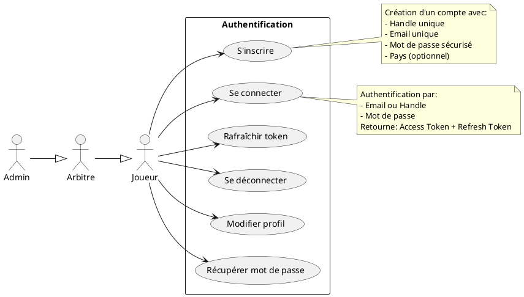

### 4.2 Cas d'Utilisation - Gestion des Matchs

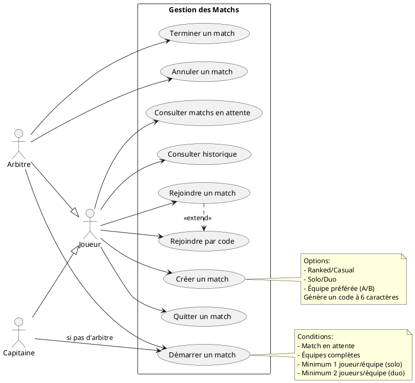

### 4.3 Cas d'Utilisation - Déroulement d'une Partie

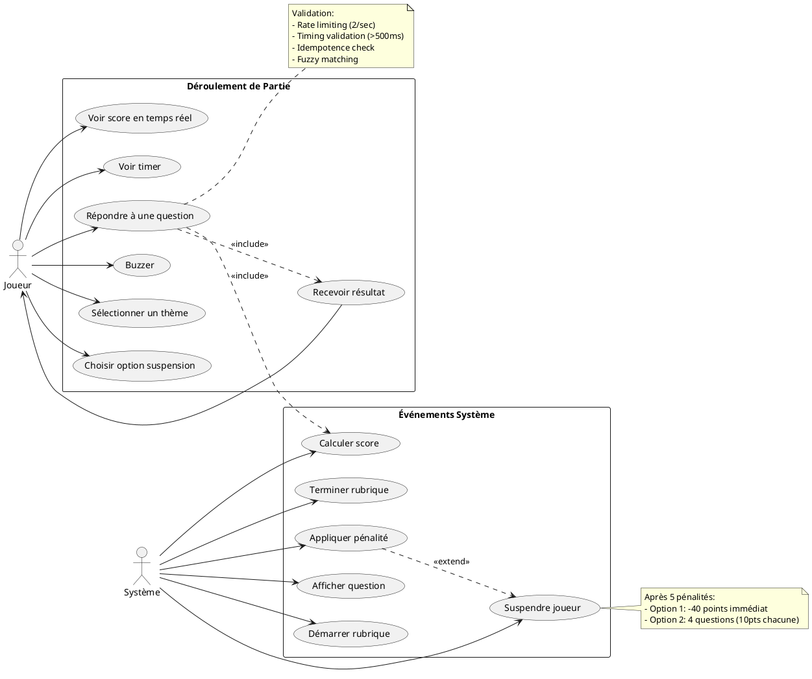

### 4.4 Cas d'Utilisation - Gestion du Contenu

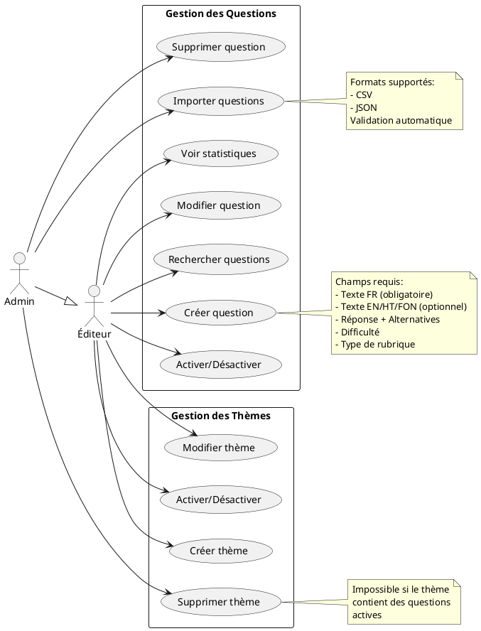

### 4.5 Cas d'Utilisation - Administration

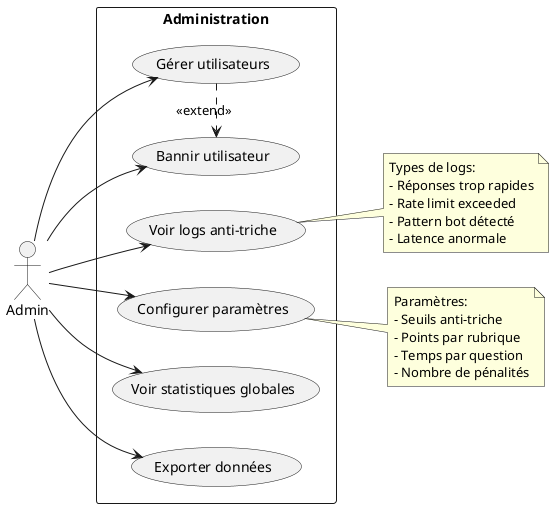

---

## 5. Flux de Données

### 5.1 Flux d'Authentification

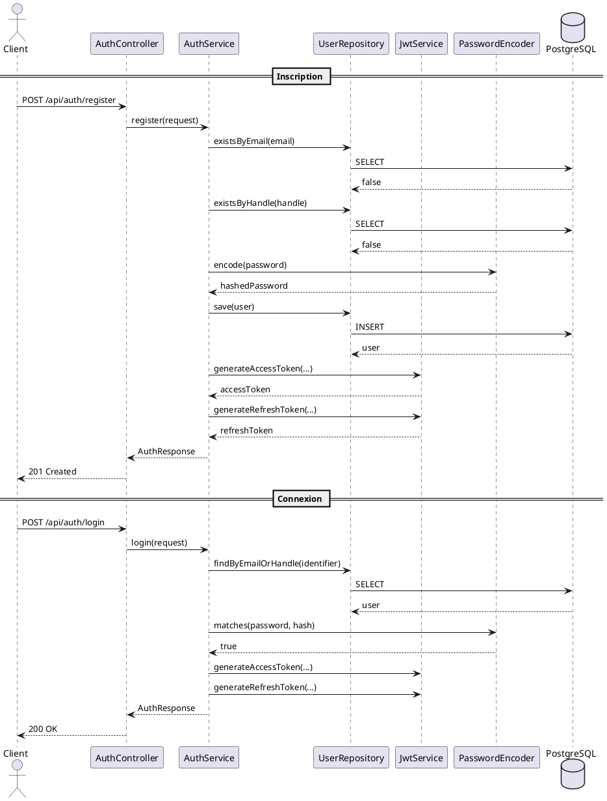

### 5.2 Flux de Création de Match

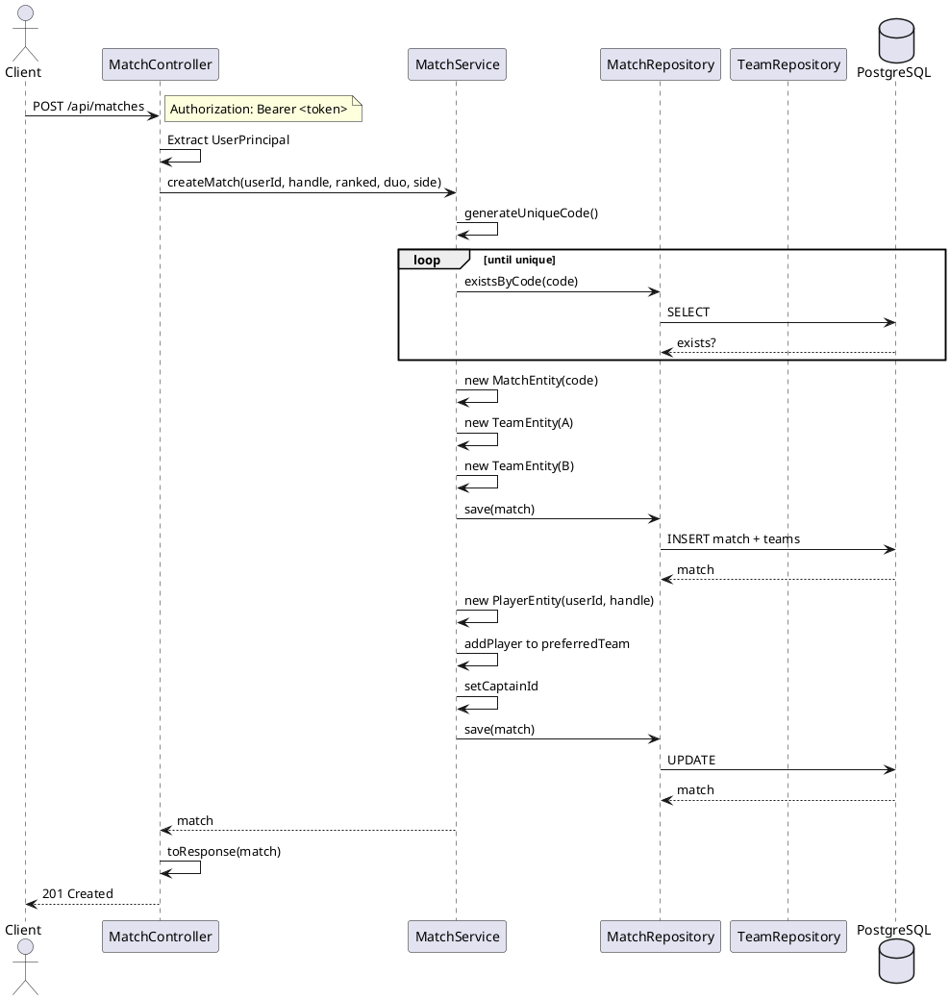

### 5.3 Flux de Jeu - Réponse à une Question

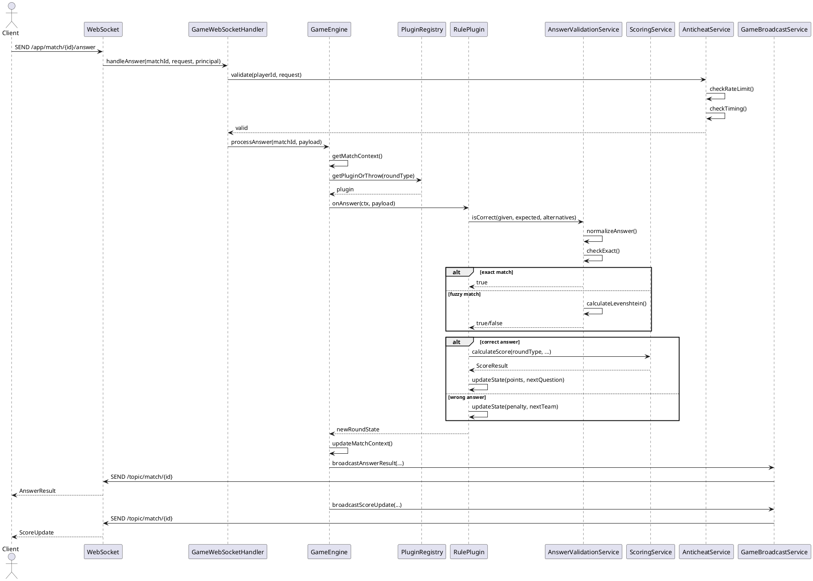

### 5.4 Flux de Rubrique CASCADE

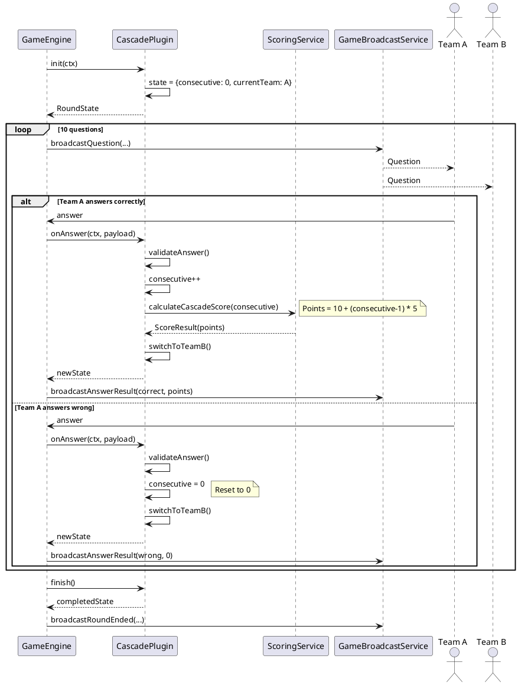

### 5.5 Flux WebSocket - Connexion et Événements

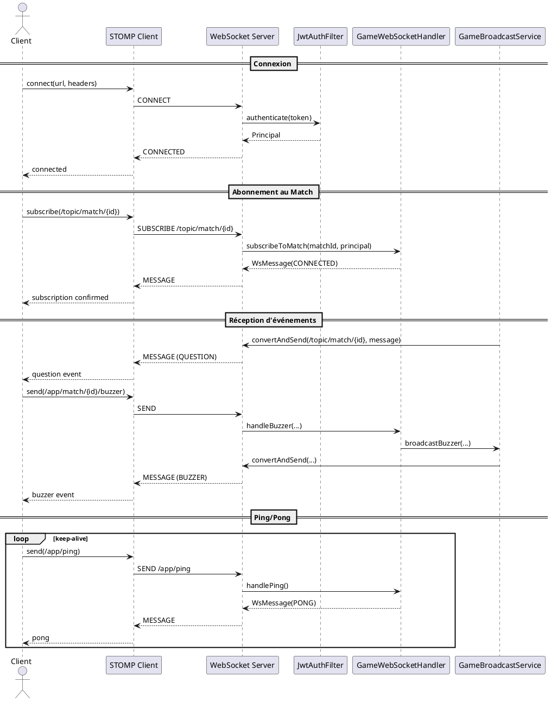

---

## 6. Services et Classes

### 6.1 AuthService

**Package:** `com.mindsoccer.api.service`

**Responsabilités:**
- Inscription des utilisateurs
- Authentification par email ou handle
- Gestion des tokens JWT

**Méthodes:**

| Méthode | Description |
|---------|-------------|
| `register(RegisterRequest)` | Crée un compte et retourne les tokens |
| `login(LoginRequest)` | Authentifie et retourne les tokens |
| `refreshToken(RefreshTokenRequest)` | Génère de nouveaux tokens |

**Flux d'inscription:**

```
1. Vérifier unicité email
2. Vérifier unicité handle
3. Hasher le mot de passe (BCrypt)
4. Créer l'entité UserEntity
5. Persister en base
6. Générer access token (15min)
7. Générer refresh token (7 jours)
8. Retourner AuthResponse
```

### 6.2 MatchService

**Package:** `com.mindsoccer.match.service`

**Responsabilités:**
- Cycle de vie complet des matchs
- Gestion des équipes et joueurs
- Mise à jour des scores

**Méthodes:**

| Méthode | Description |
|---------|-------------|
| `createMatch(userId, handle, ranked, duo, side)` | Crée un nouveau match |
| `joinMatch(matchId, userId, handle, side)` | Rejoint un match existant |
| `joinByCode(code, userId, handle, side)` | Rejoint via code |
| `leaveMatch(matchId, userId)` | Quitte un match en attente |
| `startMatch(matchId, refereeId)` | Démarre le match |
| `finishMatch(matchId)` | Termine et détermine le vainqueur |
| `updateScore(matchId, side, points)` | Met à jour le score |

**États du match:**

```
WAITING ──start()──> IN_PROGRESS ──finish()──> FINISHED
    │                      │
    └──cancel()──> CANCELLED <──cancel()──┘
```

### 6.3 QuestionService

**Package:** `com.mindsoccer.content.service`

**Responsabilités:**
- CRUD des questions
- Recherche multi-critères
- Sélection aléatoire pour le jeu
- Statistiques d'utilisation

**Méthodes de sélection aléatoire:**

| Méthode | Description |
|---------|-------------|
| `getRandomByTheme(themeId, count, excludeIds)` | Par thème |
| `getRandomByRoundType(roundType, count, excludeIds)` | Par type de rubrique |
| `getRandomByDifficulty(difficulty, count, excludeIds)` | Par difficulté |
| `getRandomByImposedLetter(letter, count, excludeIds)` | Par lettre imposée |

**Critères de recherche:**

```java
QuestionSearchCriteria.builder()
    .themeId(themeId)
    .roundType(RoundType.CASCADE)
    .difficulty(Difficulty.MEDIUM)
    .format(QuestionFormat.MULTIPLE_CHOICE)
    .searchText("capitale")
    .build();
```

### 6.4 ScoringService

**Package:** `com.mindsoccer.scoring.service`

**Responsabilités:**
- Calcul des points selon les règles de chaque rubrique
- Gestion des bonus et malus

**Calculs spécifiques:**

| Méthode | Formule/Logique |
|---------|-----------------|
| `calculateCascadeScore(consecutive)` | 10 + (consecutive - 1) * 5 |
| `calculateIdentificationScore(hintIndex)` | [25, 20, 15, 10, 5][hintIndex] |
| `calculateRelaisBonus(timeMs)` | Bonus si temps < seuil |
| `calculateCimeBonus(correctAnswers)` | Bonus progressif |

### 6.5 AnswerValidationService

**Package:** `com.mindsoccer.scoring.service`

**Responsabilités:**
- Validation souple des réponses
- Normalisation des textes
- Distance de Levenshtein

**Algorithme de validation:**

```
1. Normaliser réponse donnée et attendue:
   - Supprimer accents
   - Convertir en minuscules
   - Supprimer caractères spéciaux
   - Normaliser espaces

2. Comparaison exacte après normalisation
   → Si match: CORRECT

3. Calcul distance de Levenshtein
   - Réponse < 5 chars: distance max = 0
   - Réponse 5-10 chars: distance max = 1
   - Réponse 10-20 chars: distance max = 2
   - Réponse > 20 chars: distance max = 3

4. Vérification alternatives
   → Si une alternative match: CORRECT

5. Sinon: INCORRECT
```

### 6.6 RatingService

**Package:** `com.mindsoccer.scoring.service`

**Responsabilités:**
- Calcul du classement ELO
- Mise à jour des ratings après match

**Formules ELO:**

```
Score attendu: E = 1 / (1 + 10^((Ro - Rp) / 400))

Nouveau rating: R' = R + K * (S - E)
- K = 32 (facteur de développement)
- S = 1.0 (victoire), 0.5 (nul), 0.0 (défaite)
- R borné entre 100 et 3000
```

### 6.7 PenaltyService

**Package:** `com.mindsoccer.scoring.service`

**Responsabilités:**
- Enregistrement des pénalités
- Gestion des suspensions

**Règles:**

```
- Seuil de suspension: 5 pénalités
- Option 1 (IMMEDIATE_40): -40 points
- Option 2 (FOUR_QUESTIONS): 4 questions à 10 points chacune
- Libération quand points récupérés = 0
```

### 6.8 RateLimitService

**Package:** `com.mindsoccer.anticheat.service`

**Responsabilités:**
- Limitation des requêtes par action
- Protection contre le spam

**Limites:**

| Action | Limite | Fenêtre |
|--------|--------|---------|
| Answer | 2 | 1 seconde |
| Buzzer | 3 | 1 seconde |
| General | 100 | 1 minute |

**Implémentation:** Token Bucket avec refill automatique

### 6.9 TimingValidationService

**Package:** `com.mindsoccer.anticheat.service`

**Responsabilités:**
- Détection des réponses trop rapides
- Détection des patterns de bot

**Seuils:**

| Paramètre | Valeur |
|-----------|--------|
| Temps minimum | 500ms |
| Latence max | 5000ms |
| Seuil suspicion | 1000ms |

**Détection de bot:**
- Écart-type < 50ms ET moyenne < 2000ms → Pattern bot

### 6.10 GameBroadcastService

**Package:** `com.mindsoccer.realtime.service`

**Responsabilités:**
- Diffusion des événements aux participants
- Messages ciblés par utilisateur

**Types d'événements:**

| Event | Description |
|-------|-------------|
| MATCH_STARTED | Début du match |
| MATCH_ENDED | Fin du match avec scores finaux |
| ROUND_STARTED | Début d'une rubrique |
| ROUND_ENDED | Fin d'une rubrique |
| QUESTION | Nouvelle question |
| ANSWER_RESULT | Résultat d'une réponse |
| QUESTION_TIMEOUT | Temps écoulé |
| BUZZER | Joueur a buzzé |
| SCORE_UPDATED | Mise à jour du score |
| PENALTY | Pénalité attribuée |
| PLAYER_SUSPENDED | Joueur suspendu |
| TIMER_TICK | Synchronisation du timer |

---

## 7. Système de Plugins

### 7.1 Architecture des Plugins

```
┌─────────────────────────────────────────────────────────────┐
│                      RulePlugin (Interface)                  │
├─────────────────────────────────────────────────────────────┤
│ + type(): RoundType                                         │
│ + init(MatchContext): RoundState                            │
│ + onTick(MatchContext, Duration): RoundState                │
│ + onAnswer(MatchContext, AnswerPayload): RoundState         │
│ + applyScoring(MatchContext): void                          │
└─────────────────────────────────────────────────────────────┘
                              △
                              │
┌─────────────────────────────────────────────────────────────┐
│                 AbstractRulePlugin (Abstract)                │
├─────────────────────────────────────────────────────────────┤
│ # scoringService: ScoringService                            │
│ # validationService: AnswerValidationService                │
├─────────────────────────────────────────────────────────────┤
│ # withExtra(state, key, value): RoundState                  │
│ # withExtras(state, Map): RoundState                        │
│ # withQuestion(state, index, id, time): RoundState          │
│ # withRemainingTime(state, time): RoundState                │
│ # getExtra(state, key, default): T                          │
│ # validateAnswer(given, expected, alts): boolean            │
│ # getOppositeTeam(side): TeamSide                           │
│ # decrementTime(state, dt): RoundState                      │
│ # isTimeUp(state): boolean                                  │
└─────────────────────────────────────────────────────────────┘
                              △
                              │
        ┌─────────────────────┼─────────────────────┐
        │                     │                     │
┌───────┴───────┐    ┌───────┴───────┐    ┌───────┴───────┐
│ CascadePlugin │    │  SmashPlugin  │    │  DuelPlugin   │
└───────────────┘    └───────────────┘    └───────────────┘
```

### 7.2 RoundState (État Immutable)

```java
public record RoundState(
    RoundType type,          // Type de rubrique
    Phase phase,             // Phase actuelle
    int questionIndex,       // Index de question
    UUID currentQuestionId,  // ID question courante
    UUID activePlayerId,     // Joueur actif (buzzer)
    long remainingTimeMs,    // Temps restant
    boolean finished,        // Terminé?
    Map<String, Object> extra // Données spécifiques
) {
    public enum Phase {
        WAITING,       // En attente
        ANNOUNCE,      // Annonce de la rubrique
        QUESTION_SHOWN,// Question affichée
        ANSWER_WINDOW, // Fenêtre de réponse
        VALIDATING,    // Validation en cours
        TRANSITION,    // Transition
        COMPLETED      // Terminé
    }
}
```

### 7.3 Exemple: CascadePlugin

```java
@Component
public class CascadePlugin extends AbstractRulePlugin {

    private static final String CONSECUTIVE_KEY = "consecutive";
    private static final String CURRENT_TEAM_KEY = "currentTeam";

    @Override
    public RoundType type() {
        return RoundType.CASCADE;
    }

    @Override
    public RoundState init(MatchContext ctx) {
        RoundState state = RoundState.initial(RoundType.CASCADE);
        return withExtras(state, Map.of(
            CONSECUTIVE_KEY, 0,
            CURRENT_TEAM_KEY, TeamSide.A
        ));
    }

    @Override
    public RoundState onAnswer(MatchContext ctx, AnswerPayload payload) {
        RoundState state = ctx.currentRoundState();

        // Vérifier équipe
        TeamSide currentTeam = getExtra(state, CURRENT_TEAM_KEY, TeamSide.A);
        if (payload.team() != currentTeam) {
            return state; // Ignorer
        }

        // Valider réponse
        boolean correct = validateAnswer(payload.answer(),
            getExpectedAnswer(state), null);

        int consecutive = getExtra(state, CONSECUTIVE_KEY, 0);
        int newConsecutive = correct ? consecutive + 1 : 0;

        // Prochaine question
        int nextIndex = state.questionIndex() + 1;
        if (nextIndex >= QUESTION_COUNT) {
            return state.completed();
        }

        return withExtras(state, Map.of(
            CONSECUTIVE_KEY, newConsecutive,
            CURRENT_TEAM_KEY, getOppositeTeam(currentTeam)
        ));
    }

    public int calculatePoints(int consecutiveCorrect) {
        return 10 + (consecutiveCorrect - 1) * 5;
    }
}
```

### 7.4 PluginRegistry

```java
@Component
public class PluginRegistry {

    private final Map<RoundType, RulePlugin> plugins;

    public PluginRegistry(List<RulePlugin> pluginList) {
        this.plugins = new EnumMap<>(RoundType.class);
        for (RulePlugin plugin : pluginList) {
            plugins.put(plugin.type(), plugin);
        }
    }

    public Optional<RulePlugin> getPlugin(RoundType type) {
        return Optional.ofNullable(plugins.get(type));
    }

    public RulePlugin getPluginOrThrow(RoundType type) {
        return getPlugin(type).orElseThrow(() ->
            new IllegalArgumentException("No plugin for: " + type));
    }

    public boolean hasPlugin(RoundType type) {
        return plugins.containsKey(type);
    }

    public List<RoundType> getSupportedTypes() {
        return List.copyOf(plugins.keySet());
    }
}
```

### 7.5 Tableau des 20 Rubriques

| # | Type | Description | Points | Spécificités |
|---|------|-------------|--------|--------------|
| 1 | CASCADE | Questions alternées | 10, 15, 20... | Reset sur erreur |
| 2 | SMASH | Annonce + réponse | Variable | Vol possible |
| 3 | PANIER | Choix de thème | Standard | 4 questions/thème |
| 4 | RELAIS | Passage entre joueurs | Standard | Bonus sans faute |
| 5 | SPRINT_FINAL | Questions rapides | Standard | Fin de match |
| 6 | DUEL | Face-à-face | Standard | Buzzer + vol |
| 7 | SAUT_PATRIOTIQUE | Patrimoine national | Standard | Bonus Patriote |
| 8 | ECHAPPEE | Time attack | Standard | Pénalité temps |
| 9 | ESTOCADE | Attaque/Défense | 40pts/question | Choix thème adversaire |
| 10 | MARATHON | 10 questions/équipe | Standard | Bonus vitesse/série |
| 11 | JACKPOT | Multiplicateurs | x1, x2, x3 | Super Jackpot |
| 12 | TRANSALT | Traduction | Standard | Bonus prononciation |
| 13 | CROSS_COUNTRY | Géographie | Standard | Bonus parcours parfait |
| 14 | CROSS_DICTIONARY | Mots croisés | Standard | Bonus connexion |
| 15 | TIRS_AU_BUT | Penalty shootout | Session | Mort subite |
| 16 | CAPOEIRA | Rounds rapides | Standard | Combo system |
| 17 | CIME | Escalade | Progressif | Consolidation |
| 18 | RANDONNEE_LEXICALE | Chaîne de mots | Standard | Bonus longueur |
| 19 | IDENTIFICATION | Indices progressifs | 25, 20, 15, 10, 5 | Élimination joueur |
| 20 | PANIER | (Variante) | Standard | 6 thèmes |

---

## 8. WebSocket et Temps Réel

### 8.1 Configuration STOMP

```java
@Configuration
@EnableWebSocketMessageBroker
public class WebSocketConfig implements WebSocketMessageBrokerConfigurer {

    @Override
    public void configureMessageBroker(MessageBrokerRegistry config) {
        // Destinations pour les abonnements (server -> client)
        config.enableSimpleBroker("/topic", "/queue");
        // Préfixe pour les messages (client -> server)
        config.setApplicationDestinationPrefixes("/app");
        // Préfixe pour messages ciblés
        config.setUserDestinationPrefix("/user");
    }

    @Override
    public void registerStompEndpoints(StompEndpointRegistry registry) {
        registry.addEndpoint("/ws")
            .setAllowedOrigins("*")
            .withSockJS();
    }
}
```

### 8.2 Destinations WebSocket

| Destination | Type | Description |
|-------------|------|-------------|
| `/ws` | Endpoint | Point de connexion STOMP |
| `/topic/match/{id}` | Subscription | Événements du match |
| `/queue/events` | Subscription | Événements personnels |
| `/app/match/{id}/answer` | Send | Soumettre une réponse |
| `/app/match/{id}/buzzer` | Send | Envoyer un buzzer |
| `/app/match/{id}/select-theme` | Send | Sélectionner un thème |
| `/app/ping` | Send | Keep-alive |

### 8.3 Format des Messages

```java
public record WsMessage<T>(
    WsEventType type,
    T payload,
    long timestamp
) {
    public static <T> WsMessage<T> of(WsEventType type, T payload) {
        return new WsMessage<>(type, payload, System.currentTimeMillis());
    }
}

public enum WsEventType {
    // Connexion
    CONNECTED, DISCONNECTED, PONG,
    // Match
    MATCH_STARTED, MATCH_ENDED, SCORE_UPDATED,
    // Round
    ROUND_STARTED, ROUND_ENDED,
    // Question
    QUESTION, ANSWER_RESULT, QUESTION_TIMEOUT,
    // Actions
    BUZZER, THEME_SELECTED,
    // Joueur
    PLAYER_JOINED, PLAYER_LEFT, PENALTY,
    PLAYER_SUSPENDED, SUSPENSION_ENDED,
    // Système
    TIMER_TICK, ERROR
}
```

### 8.4 Exemple de Payloads

```java
// Question
public record QuestionPayload(
    UUID questionId,
    String text,
    List<String> choices,
    long timeLimitMs,
    TeamSide targetTeam,
    int questionIndex
) {}

// Résultat de réponse
public record AnswerResultPayload(
    UUID playerId,
    TeamSide team,
    boolean correct,
    int points,
    String correctAnswer
) {}

// Buzzer
public record BuzzerPayload(
    UUID playerId,
    TeamSide team,
    long timestamp
) {}
```

---

## 9. Sécurité

### 9.1 Authentification JWT

```
┌─────────────────────────────────────────────────────────────┐
│                    JWT Access Token                          │
├─────────────────────────────────────────────────────────────┤
│ Header:                                                      │
│   { "alg": "HS512", "typ": "JWT" }                          │
├─────────────────────────────────────────────────────────────┤
│ Payload:                                                     │
│   { "sub": "<userId>",                                       │
│     "handle": "<handle>",                                    │
│     "role": "PLAYER|REFEREE|ADMIN",                          │
│     "type": "ACCESS",                                        │
│     "iat": <timestamp>,                                      │
│     "exp": <timestamp + 15min> }                             │
├─────────────────────────────────────────────────────────────┤
│ Signature: HMACSHA512(header.payload, secret)               │
└─────────────────────────────────────────────────────────────┘
```

### 9.2 Configuration Spring Security

```java
@Configuration
@EnableWebSecurity
public class SecurityConfig {

    @Bean
    public SecurityFilterChain filterChain(HttpSecurity http) {
        return http
            .csrf(csrf -> csrf.disable())
            .sessionManagement(sm ->
                sm.sessionCreationPolicy(STATELESS))
            .authorizeHttpRequests(auth -> auth
                .requestMatchers("/api/auth/**").permitAll()
                .requestMatchers("/ws/**").permitAll()
                .requestMatchers("/swagger-ui/**").permitAll()
                .requestMatchers("/api/admin/**").hasRole("ADMIN")
                .anyRequest().authenticated())
            .addFilterBefore(jwtAuthFilter,
                UsernamePasswordAuthenticationFilter.class)
            .build();
    }
}
```

### 9.3 Protection des Endpoints

| Endpoint | Accès | Description |
|----------|-------|-------------|
| `/api/auth/*` | Public | Authentification |
| `/api/matches/*` | Authenticated | Gestion matchs |
| `/api/questions/*` | Authenticated | Consultation questions |
| `/api/themes/*` | Authenticated | Consultation thèmes |
| `/api/admin/*` | ADMIN only | Administration |
| `/ws/*` | Authenticated | WebSocket |

### 9.4 Mesures Anti-Triche

| Mesure | Description |
|--------|-------------|
| Rate Limiting | 2 réponses/sec, 3 buzzers/sec |
| Timing Validation | Réponse min 500ms |
| Bot Detection | Variance temps < 50ms |
| Idempotency | Clé unique par réponse |
| Token Validation | JWT vérifié à chaque requête |

---

## 10. Base de Données

### 10.1 Schéma Entité-Relation

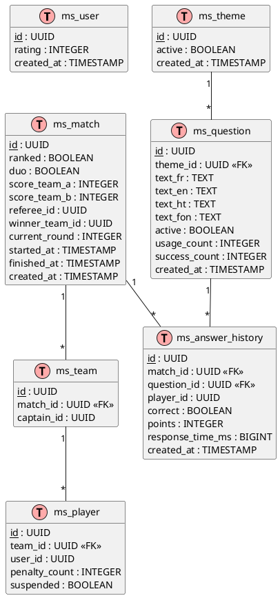

### 10.2 Index Recommandés

```sql
-- Recherche de match par code
CREATE INDEX idx_match_code ON ms_match(code);

-- Matchs par statut
CREATE INDEX idx_match_status ON ms_match(status);

-- Questions par thème
CREATE INDEX idx_question_theme ON ms_question(theme_id);

-- Questions par type de round
CREATE INDEX idx_question_round_type ON ms_question(round_type);

-- Questions actives
CREATE INDEX idx_question_active ON ms_question(active);

-- Historique par match
CREATE INDEX idx_answer_history_match ON ms_answer_history(match_id);

-- Utilisateur par email/handle
CREATE INDEX idx_user_email ON ms_user(email);
CREATE INDEX idx_user_handle ON ms_user(handle);
```

### 10.3 Requêtes Optimisées

```java
// Questions aléatoires par thème (avec exclusion)
@Query("""
    SELECT q FROM QuestionEntity q
    WHERE q.theme.id = :themeId
    AND q.active = true
    AND q.id NOT IN :excludeIds
    ORDER BY RANDOM()
    """)
List<QuestionEntity> findRandomByTheme(
    @Param("themeId") UUID themeId,
    @Param("excludeIds") List<UUID> excludeIds,
    Pageable pageable
);

// Matchs d'un joueur
@Query("""
    SELECT m FROM MatchEntity m
    JOIN m.teams t
    JOIN t.players p
    WHERE p.userId = :userId
    AND m.status = :status
    """)
List<MatchEntity> findByPlayerAndStatus(
    @Param("userId") UUID userId,
    @Param("status") MatchStatus status
);
```

---

## Annexes

### A. Codes d'Erreur

| Code | HTTP | Description |
|------|------|-------------|
| 1000 | 500 | Erreur interne |
| 1001 | 404 | Ressource non trouvée |
| 1002 | 400 | Requête invalide |
| 2001 | 401 | Non authentifié |
| 2002 | 401 | Token invalide |
| 2003 | 401 | Token expiré |
| 2004 | 403 | Accès refusé |
| 2005 | 409 | Email déjà utilisé |
| 2006 | 409 | Handle déjà utilisé |
| 3001 | 404 | Match non trouvé |
| 3002 | 409 | Match déjà démarré |
| 3003 | 409 | Match complet |
| 3004 | 400 | Équipes incomplètes |
| 4001 | 400 | Round non actif |
| 4002 | 400 | Pas votre tour |
| 4003 | 400 | Déjà répondu |
| 5001 | 429 | Rate limit dépassé |

### B. Constantes du Jeu

```java
public final class GameConstants {
    // Équipes
    public static final int TEAM_MIN_SIZE = 1;
    public static final int TEAM_MAX_SIZE = 5;
    public static final int TEAM_DUO_SIZE = 2;

    // Questions par rubrique
    public static final int CASCADE_QUESTION_COUNT = 10;
    public static final int MARATHON_QUESTION_COUNT = 10;
    public static final int DUEL_QUESTION_COUNT = 5;

    // Points
    public static final int DEFAULT_POINTS = 10;
    public static final int ESTOCADE_POINTS = 40;
    public static final int[] IDENTIFICATION_POINTS = {25, 20, 15, 10, 5};

    // Pénalités
    public static final int PENALTY_THRESHOLD = 5;
    public static final int SUSPENSION_IMMEDIATE = 40;
    public static final int SUSPENSION_QUESTIONS = 4;

    // Temps (ms)
    public static final long DEFAULT_ANSWER_TIMEOUT = 10_000;
    public static final long BUZZER_TIMEOUT = 5_000;
}
```

### C. Variables d'Environnement

| Variable | Description | Défaut |
|----------|-------------|--------|
| `DB_HOST` | Hôte PostgreSQL | localhost |
| `DB_PORT` | Port PostgreSQL | 5432 |
| `DB_NAME` | Nom de la base | mindsoccer |
| `DB_USER` | Utilisateur | mindsoccer |
| `DB_PASSWORD` | Mot de passe | - |
| `REDIS_HOST` | Hôte Redis | localhost |
| `REDIS_PORT` | Port Redis | 6379 |
| `JWT_SECRET` | Clé secrète JWT | - |
| `JWT_ACCESS_EXPIRY` | Durée access token | 900 |
| `JWT_REFRESH_EXPIRY` | Durée refresh token | 604800 |

---

*Document généré le 1er décembre 2025*
*Version: 1.0.0*
